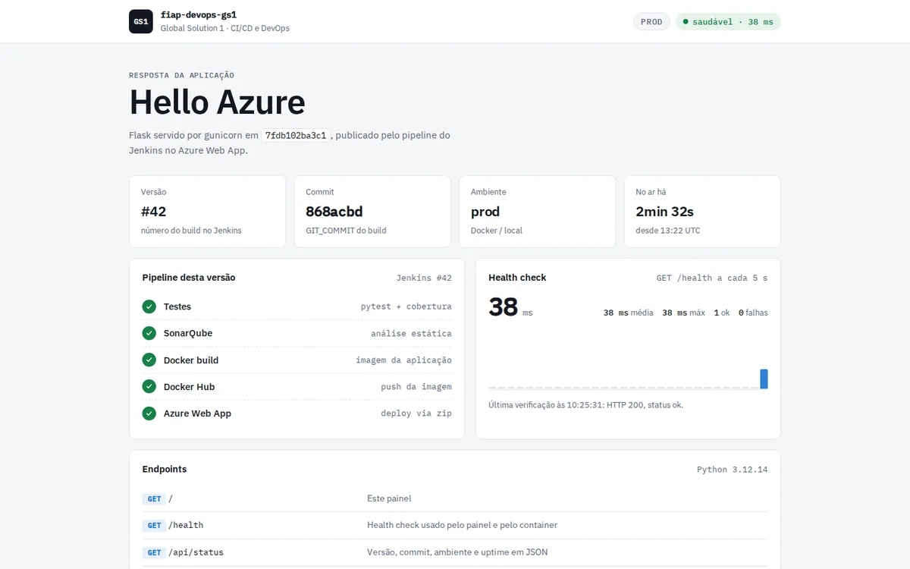
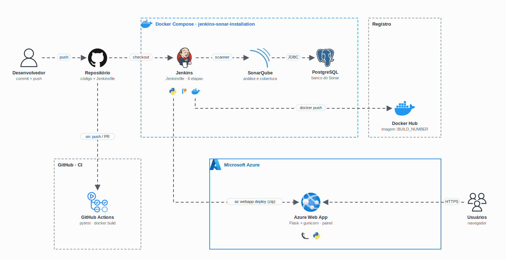

<h1 align="center">
  GS1 - Pipeline CI/CD com Jenkins, SonarQube e Azure
</h1>

<p align="center">
  
</p>

<p align="center">
  <a href="https://skillicons.dev">
    
  </a>
</p>

## Qual a finalidade do projeto?

Global Solution 1 da disciplina de **DevOps e CI/CD** (FIAP, 2025). O objetivo é montar uma esteira de **integração e entrega contínua** completa para uma aplicação Python: do `git push` até a aplicação no ar no **Azure Web App**, passando por testes automatizados, análise de qualidade no **SonarQube** e publicação da imagem no **Docker Hub**.

A infraestrutura de CI roda localmente em containers: um `docker compose` sobe o **Jenkins** (com Docker CLI, Python, Node.js e Azure CLI já instalados), o **SonarQube** e o **PostgreSQL** que guarda os dados do Sonar. O `Jenkinsfile` descreve o pipeline inteiro como código.

A aplicação é um Flask "Hello Azure" que virou um **painel de status do deploy**: mostra qual build está no ar, de qual commit veio, há quanto tempo o processo está rodando e faz um health check ao vivo.

## Arquitetura

<p align="center">
  
</p>

## O que foi construído

### Aplicação

| Rota | O que faz |
|---|---|
| `GET /` | Painel de status: versão, commit, ambiente, uptime, etapas do pipeline e health check ao vivo |
| `GET /health` | Health check (`{"status": "ok"}`), usado pelo painel e pelo `HEALTHCHECK` da imagem |
| `GET /api/status` | Os mesmos dados do painel em JSON |
| `GET /api/hello` | Resposta original do projeto: `{"message": "Hello Azure"}` |

A versão e o commit chegam pelas variáveis `APP_VERSION` e `GIT_COMMIT`: o Jenkins passa o `BUILD_NUMBER` e o `GIT_COMMIT` como `--build-arg` na imagem e como *app settings* no Web App. Fora do pipeline o painel mostra `local`.

### Pipeline do Jenkins (`Jenkinsfile`)

| Etapa | O que faz |
|---|---|
| Preparar ambiente | Cria o `venv` e instala `requirements-dev.txt` |
| Testes | `pytest` com cobertura (`coverage.xml`) e relatório JUnit publicado no Jenkins |
| SonarQube | `sonar-scanner` com as regras de `sonar-project.properties` |
| Docker build | Imagem `<DOCKERHUB_REPO>:<BUILD_NUMBER>` e `:latest` |
| Push para o Docker Hub | `docker login --password-stdin` com a credencial `dockerhub` |
| Deploy no Azure Web App | `az login` com Service Principal, zip da aplicação, *startup command* do gunicorn e `az webapp deploy` |

Parâmetros do job: `DOCKERHUB_REPO` (padrão `william201192/fiap-devops-gs1`), `AZURE_APP_NAME`, `AZURE_RG` e `DEPLOY` (ligado por padrão; desligado, o pipeline para depois do `docker build`).

### Stack de CI (`jenkins-sonar-installation/`)

| Serviço | Imagem | Porta no host |
|---|---|---|
| `jenkins` | `jenkins/jenkins:lts-jdk17` + Docker CLI, Python 3, Node.js, zip e Azure CLI | `8080` (web) e `50000` (agentes) |
| `sonarqube` | `sonarqube:lts-community` | `9001` |
| `sonar_db` | `postgres:15`, com healthcheck | interna |

### Segurança

| Ponto | Como foi resolvido |
|---|---|
| Service Principal do Azure | Nada no código: vem das credenciais `azure-sp` e `azure-tenant-id` do Jenkins, só dentro do `withCredentials` do deploy |
| Docker Hub | Token na credencial `dockerhub`, enviado por `--password-stdin`; repositório parametrizado |
| Banco do SonarQube | Senha só no `.env` (fora do git); a compose não sobe sem ela |
| Container da aplicação | `python:3.12-slim`, usuário sem root, gunicorn em vez do servidor de desenvolvimento |

### GitHub Actions (`.github/workflows/ci.yml`)

Roda em cada push na `main` e em pull requests, sem nenhuma credencial:

| Job | O que faz |
|---|---|
| Testes (pytest) | Instala as dependências e roda os testes com cobertura |
| Docker build e smoke test | Builda a imagem, sobe o container e confere `/health`, `/api/status` e `/` |
| Validar as composes | `docker compose config` das composes de dev, prod e da stack de CI |

O deploy continua só no Jenkins.

## Tecnologias utilizadas

- **Python 3.12 + Flask 3 + gunicorn:** aplicação e painel;
- **pytest + pytest-cov:** testes e cobertura;
- **Docker e Docker Compose:** imagem da aplicação, ambientes de dev e prod e a stack de CI;
- **Jenkins:** pipeline declarativo no `Jenkinsfile`;
- **SonarQube + PostgreSQL:** análise estática e de cobertura;
- **Docker Hub:** registro da imagem;
- **Azure Web App (App Service Linux) + Azure CLI:** hospedagem da aplicação;
- **GitHub Actions:** testes e build da imagem em cada push;
- **HTML, CSS e JavaScript:** painel sem framework, com tema claro e escuro (IBM Plex Sans e Mono).

## Estrutura do repositório

```text
fiap-devops-gs1/
├── main.py                        # Flask: painel, /health, /api/status e /api/hello
├── templates/index.html           # Painel de status
├── static/                        # CSS e JavaScript do painel (health check ao vivo)
├── tests/test_main.py             # Testes pytest
├── requirements.txt               # Dependências da aplicação
├── requirements-dev.txt           # + pytest e pytest-cov
├── Dockerfile                     # Imagem da aplicação (gunicorn, sem root)
├── docker-compose.dev.yml         # Dev: Flask com reload e código montado
├── docker-compose.prod.yml        # Prod: imagem publicada pelo pipeline
├── Jenkinsfile                    # Pipeline de CI/CD
├── sonar-project.properties       # Configuração do SonarQube
├── jenkins-sonar-installation/
│   ├── Dockerfile                 # Jenkins com Docker CLI, Python, Node.js e Azure CLI
│   ├── docker-compose.yaml        # Jenkins + SonarQube + PostgreSQL
│   └── .env.example               # Senha do banco e portas (copie para .env)
├── .github/workflows/ci.yml       # GitHub Actions
└── docs/                          # Demo e diagrama
```

## Fluxo de funcionamento

1. O desenvolvedor faz push no GitHub; o **GitHub Actions** roda os testes e o build da imagem.
2. O **Jenkins** faz o checkout do repositório, cria o ambiente virtual e roda o `pytest` com cobertura.
3. O `sonar-scanner` envia o código e o `coverage.xml` para o **SonarQube**, que grava a análise no **PostgreSQL**.
4. O Jenkins builda a imagem com o número do build e o commit e, com `DEPLOY` ligado, publica no **Docker Hub**.
5. Com o Service Principal, o Jenkins faz login no Azure, configura o Web App (build no deploy, versão, commit e comando do gunicorn) e envia o zip com `az webapp deploy`.
6. O Azure instala as dependências e sobe o gunicorn; o painel passa a mostrar o novo build.

## Como rodar

### Aplicação

```bash
python3 -m venv .venv && source .venv/bin/activate
pip install -r requirements-dev.txt
pytest                                   # testes
python main.py                           # http://localhost:8000
```

Com Docker:

```bash
docker compose -f docker-compose.dev.yml up --build        # dev com reload, http://localhost:8000
docker build --build-arg APP_VERSION=42 -t fiap-devops-gs1 .
docker run --rm -p 8000:8000 -e APP_ENV=prod fiap-devops-gs1
```

A compose de produção roda a imagem publicada: `DOCKERHUB_REPO=usuario/repositorio IMAGE_TAG=42 docker compose -f docker-compose.prod.yml up -d`.

### Jenkins e SonarQube

```bash
cd jenkins-sonar-installation
cp .env.example .env                     # troque SONAR_DB_PASSWORD
docker compose up -d --build
docker compose exec jenkins cat /var/jenkins_home/secrets/initialAdminPassword
```

| Endereço | O quê |
|---|---|
| http://localhost:8080 | Jenkins (senha inicial pelo comando acima) |
| http://localhost:9001 | SonarQube (`admin`/`admin` no primeiro acesso, o Sonar pede para trocar) |

Configuração no Jenkins:

1. Plugins: *Pipeline*, *Git*, *Credentials Binding*, *JUnit* e *SonarQube Scanner*.
2. **Manage Jenkins > Tools:** um *SonarQube Scanner* chamado `sonar-scanner` (instalação automática).
3. **Manage Jenkins > System:** um servidor SonarQube chamado `sonar-server` com a URL `http://sonarqube:9000` e a credencial `sonar-token`.
4. **Credentials:**

| ID | Tipo | Conteúdo |
|---|---|---|
| `sonar-token` | Secret text | Token gerado no SonarQube (*My Account > Security*) |
| `dockerhub` | Username with password | Usuário e token de acesso do Docker Hub |
| `azure-sp` | Username with password | `appId` e senha do Service Principal |
| `azure-tenant-id` | Secret text | Tenant do Azure AD |

5. Crie um job *Pipeline* apontando para este repositório (*Pipeline script from SCM*, arquivo `Jenkinsfile`).

O Service Principal pode ser criado com `az ad sp create-for-rbac --name fiap-devops-gs1 --role contributor --scopes /subscriptions/<id>/resourceGroups/<rg>`. O Web App precisa existir antes (runtime Python 3.12 no Linux).

## Como validar a entrega

```bash
pytest -v                                # 11 testes
docker build -t fiap-devops-gs1 . && docker run -d --name gs1 -p 8000:8000 fiap-devops-gs1
curl -s localhost:8000/health            # {"status":"ok"}
curl -s localhost:8000/api/status        # versão, commit, ambiente e uptime
docker rm -f gs1
```

Pontos principais de validação:

- os testes cobrem o painel, o health check, o JSON de status com e sem os dados do pipeline e a formatação do uptime;
- o `Jenkinsfile` passa no validador de pipeline declarativo do Jenkins;
- com a stack de CI no ar e `DEPLOY` desligado, o pipeline roda até o `docker build` com sucesso e o SonarQube recebe a análise (Quality Gate aprovado, 0 bugs, 0 code smells, cobertura de 97,7% no código Python);
- as etapas de push e deploy só rodam com as credenciais reais do Docker Hub e do Azure configuradas no Jenkins.

---

## Autor

**William Coelho** · RM 556336 · [@willtechdev](https://github.com/willtechdev)
